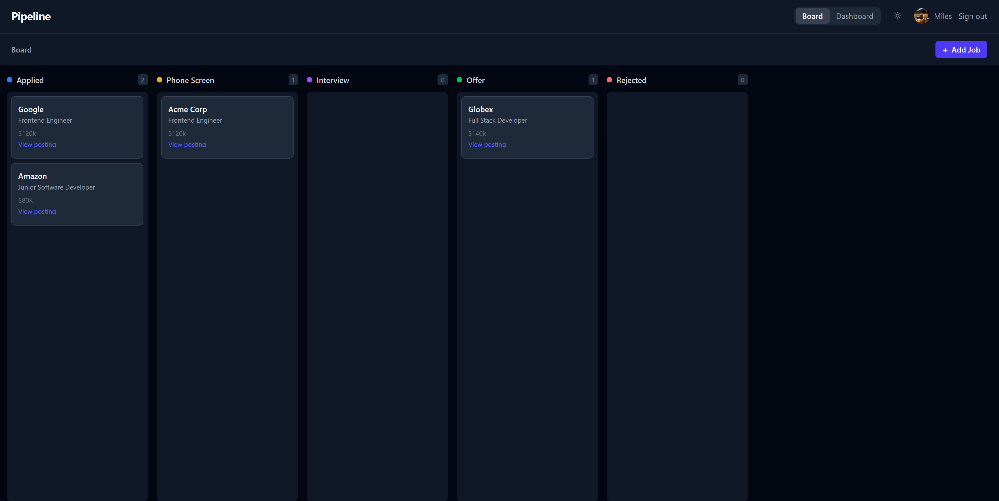

# Pipeline — Job Application Tracker

[](LICENSE)

**Live app:** [pipeline-nu-ecru.vercel.app](https://pipeline-nu-ecru.vercel.app)



A Kanban-style job application tracker that helps candidates organize their job search, track interview stages, and stay on top of every application.

## Features

- **Kanban board** — drag-and-drop cards across five stages: Applied → Phone Screen → Interview → Offer → Rejected
- **Job cards** — store company, role, salary, notes, and a link to the job posting
- **Dashboard** — response rate, offer rate, applications by stage, weekly activity chart, and avg. days per stage
- **Google OAuth** — sign in with Google, all data scoped to your account
- **Dark mode** — auto-detects system preference, toggle in the header

## Tech Stack

| Layer | Technology |
|---|---|
| Frontend | React, Vite, Tailwind CSS v4 |
| Drag & Drop | dnd-kit |
| Backend | Node.js, Express |
| Database | PostgreSQL |
| Auth | Google OAuth 2.0, Passport.js, express-session |
| Deployment | Vercel (frontend) + Railway (backend + DB) |

## Local Development

### Prerequisites
- Node.js 20+
- PostgreSQL 15+

### Setup

1. Clone the repo and install dependencies:
   ```bash
   npm install
   ```

2. Start PostgreSQL and create the database:
   ```bash
   psql -U postgres -c "CREATE DATABASE pipeline;"
   ```

3. Create `server/.env`:
   ```
   DB_HOST=localhost
   DB_PORT=5432
   DB_NAME=pipeline
   DB_USER=postgres
   DB_PASSWORD=your_password
   GOOGLE_CLIENT_ID=your_client_id
   GOOGLE_CLIENT_SECRET=your_client_secret
   SESSION_SECRET=any_long_random_string
   CLIENT_URL=http://localhost:5173
   ```

4. Start both servers:
   ```bash
   npm run dev
   ```

Frontend runs on `http://localhost:5173`, backend on `http://localhost:3001`.

## Deployment

| Service | URL |
|---|---|
| Frontend (Vercel) | [pipeline-nu-ecru.vercel.app](https://pipeline-nu-ecru.vercel.app) |
| Backend (Railway) | [pipeline-server-production-0fd5.up.railway.app](https://pipeline-server-production-0fd5.up.railway.app) |

- **Frontend** — deployed to [Vercel](https://vercel.com) with root directory `client` and `VITE_API_URL` pointing to the Railway backend
- **Backend** — deployed to [Railway](https://railway.app) with root directory `server`, a provisioned PostgreSQL database, and env vars: `GOOGLE_CLIENT_ID`, `GOOGLE_CLIENT_SECRET`, `SESSION_SECRET`, `CLIENT_URL`, `GOOGLE_CALLBACK_URL`, `NODE_ENV=production`

## Roadmap

- [ ] Follow-up reminders via email (Resend)
- [ ] Export applications to CSV
- [ ] AI-generated cover letter drafts
- [ ] Chrome extension to save job postings from LinkedIn/Indeed
